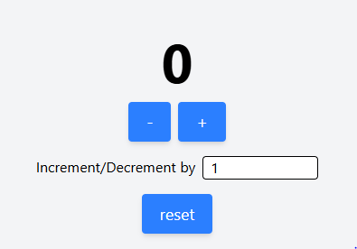

# 🔢 Counter App

A simple and responsive counter application built using **React**, **Vite**, and **Tailwind CSS**.

---

## 🚀 Features

- Increment and decrement the counter
- Custom step size input
- Reset counter to zero
- Responsive and accessible UI with Tailwind
- Input validation with support for clearing input

---

## 🛠 Tech Stack

- [React](https://reactjs.org/)
- [Vite](https://vitejs.dev/)
- [Tailwind CSS](https://tailwindcss.com/)

---

## 📦 Getting Started

### 1. Clone the Repository

```bash
git clone https://github.com/your-username/counter-app.git
cd counter-app
```

### 2. Install Dependencies

```bash
npm install
```

### 3. Run the App Locally

```bash
npm run dev
```

Then open `http://localhost:5173` in your browser.

---

## 📸 Screenshot




---

## 📁 Project Structure

```
counter-app/
├── public/
├── src/
│   ├── App.jsx
│   ├── Button.jsx
│   └── main.jsx
├── screenshot.png
├── index.html
├── package.json
└── tailwind.config.js
```

---

## 💡 Future Improvements

- Add animations and transitions
- Add keyboard accessibility
- Save counter state to local storage

---

## 📜 License

MIT © [Prateek Kumar](https://github.com/Prateek-ind)
